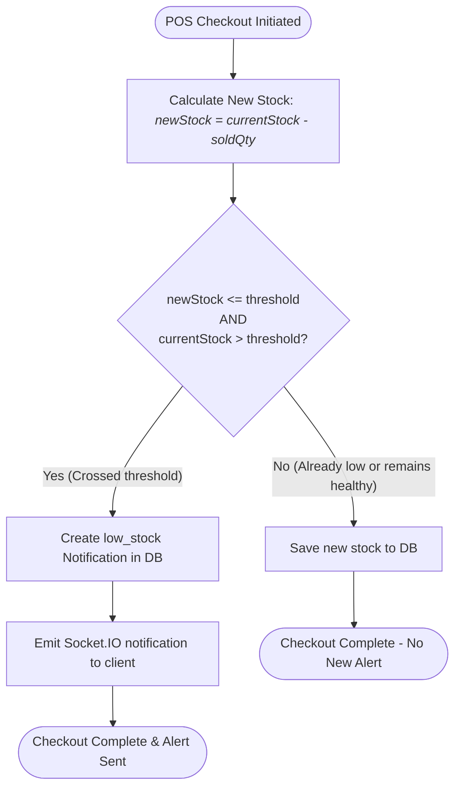
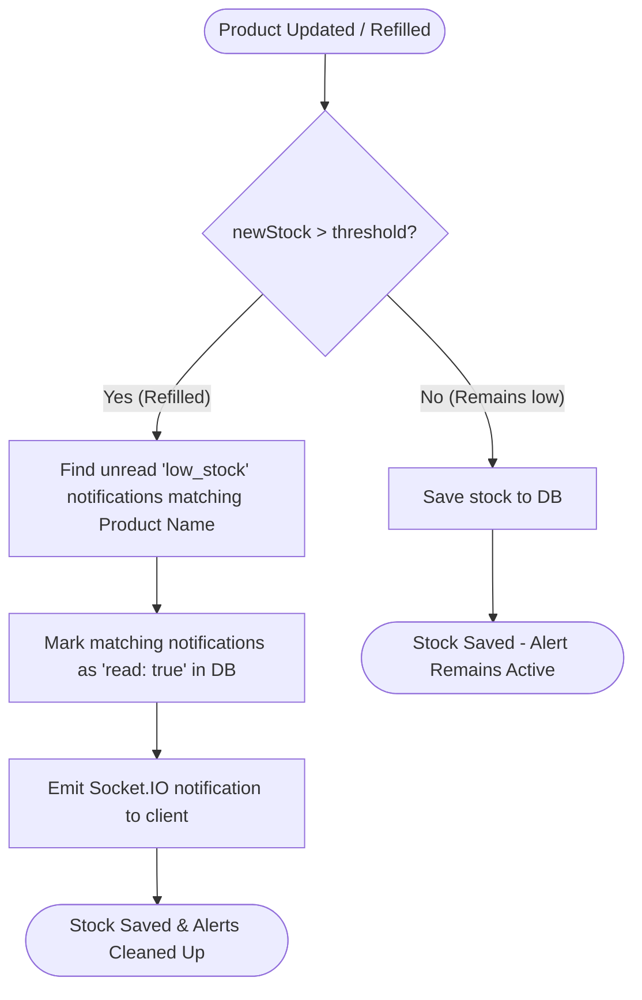

# Low Stock & Sidebar Workflows

This document outlines the workflows for the **Low Stock Alert Transition Check**, the **Stock Replenishment Alert Resolution**, and the **Collapsible Sidebar Layout**.

---

## 1. Low Stock Alert Generation (POS Checkout)

This flow prevents duplicate alerts by only generating a low-stock alert when a product's stock **crosses below or equal to** its threshold for the first time.



---

## 2. Low Stock Alert Resolution (Stock Refill/Update)

This flow automatically marks existing unread low stock alerts as read/resolved as soon as a product is refilled above its threshold.



---

## 3. Collapsible Sidebar Component

This frontend flow groups individual menu items, filters them by user permission levels, and automatically expands the active group containing the current page path.

```mermaid
graph TD
    A([User navigates or Mounts Sidebar]) --> B[Filter menu groups and items based on User Role]
    B --> C[Find if location.pathname matches any item.path in a group]
    C --> D{Is a matching child path found?}
    D -- Yes --> E[Set expandedGroups[group.name] = true]
    E --> F[Render sidebar with the active category expanded]
    D -- No --> F
```
